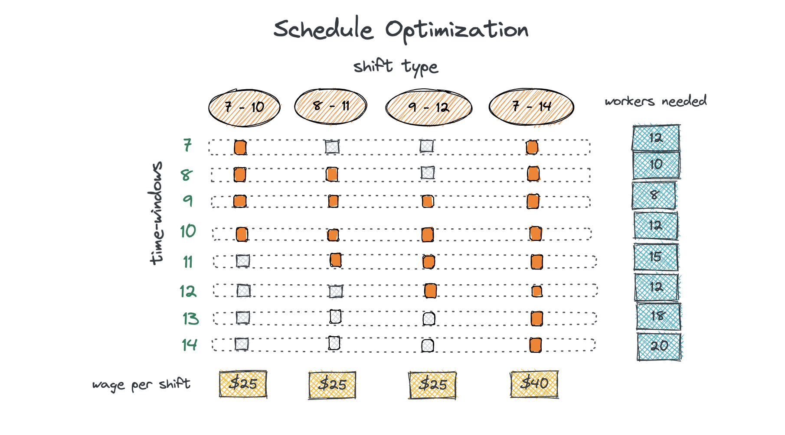

# Workforce scheduling optimization
Author: Chloe Bui

Within the context of workforce management, this notebook showcases a key exercise to develop a workforce schedule with optimal utilization of resources.

## Problem statement

In each hour slot of a day, we have forecasted the required number of BPOs to satisfy our demand:

- 7:00 - 8:00 : 12 workers needed
- 8:00 - 9:00 : 10 workers needed
- ...

Since BPOs work in shifts (typically 4 or 8 hours), their wages also vary. Our task is to create a work schedule to meet the hourly staffing requirements while simultaneously minimizing the overall cost of labor.

## Build scheduling table

First we build a scheduling table showing:
- All possible 4-hour shifts and 8-hour shifts
- Each working hour slots in a day
- Hourly staffing requirements
- Wage per shift

## Formulation

*Model formulation*    

$$\begin{align}
\text{Minimize}   & \sum_{j=0}^{\infty} {w_j y_j} \\
\text{subject to} & \sum_{j=0}^{\infty} {a_{jt} y_j} >= d_t \text{ with } t = 1, \ldots, T \\
                  & y_j >= 0 \text{ and integer } j = 1, \ldots, n
\end{align}$$

*Input parameter*

- Number of shifts ($n$)
- Number of time windows ($T$)
- Number of workers required per time window ($d_t$)
- Wage rate per shift ($w_j$)

**Decision variables**: number of workers need per work shift ($y_j$) \
**Constraints**: demand within each time window must be satisfied \
**Objective**: Minimize the total cost of wages paid to all workers

Let $a_{jt} =1$  if shift covers the time window $t (j=1,..,n; \ t=1,...,T)$ and $a_{jt} =0$ otherwise.